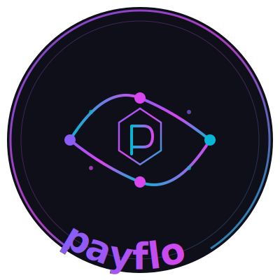
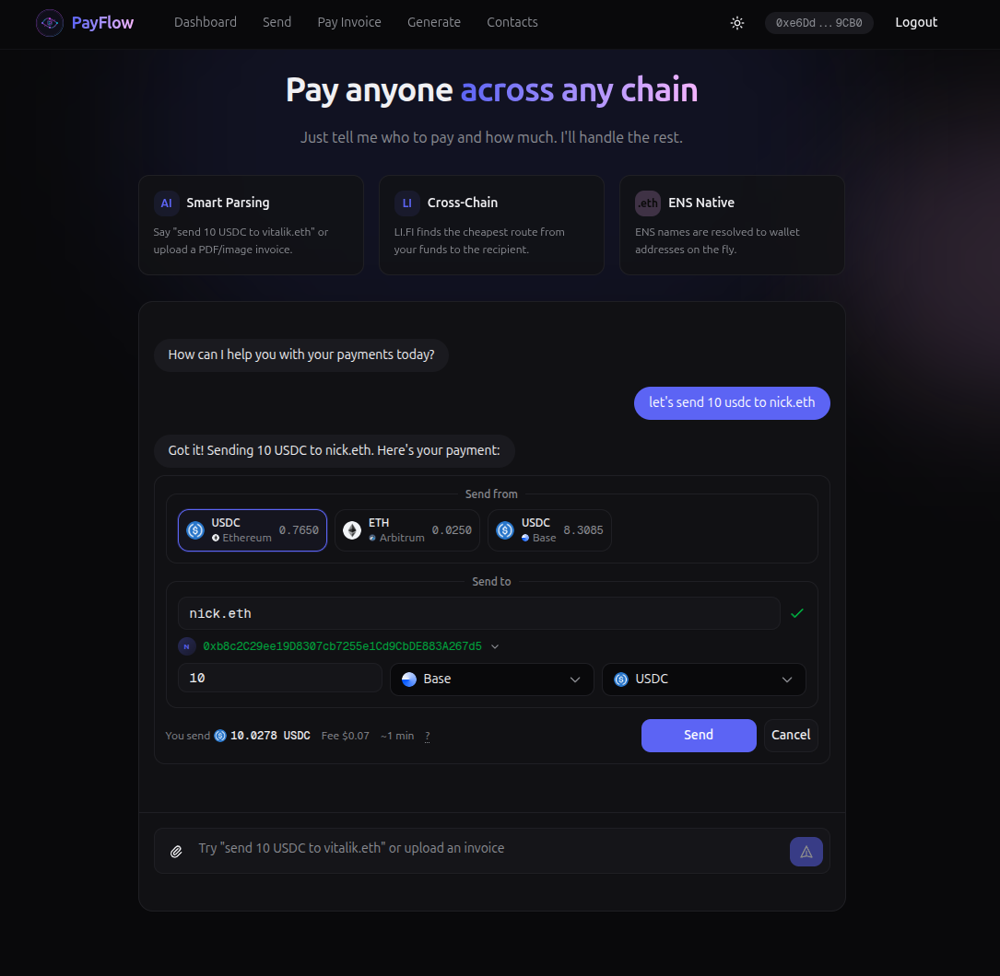

# PayFlow

<p align="center">
  
</p>

An AI-powered crypto payment application for paying anyone on any chain. 

_This is a hackathon project as part of [HackMoney 2026](https://ethglobal.com/events/hackmoney2026/)._



## What It Does

PayFlow simplifies crypto payments by combining invoice parsing, cross-chain transfers, and ENS identity into a single interface.

- **Natural Language Interface**: Type commands like "send 10 USDC to nick.eth" in the chatbot and complete the payment in one flow.
- **Invoice Parsing**: Upload a PDF or image invoice. AI extracts the recipient, amount, token, and due date automatically.
- **Cross-Chain Payments**: Pay from any token on any supported chain. The app finds the best route to deliver the exact amount the recipient expects, even if you do not have the token the recipient asked for. 
- **Contact Management**: Save addresses with ENS profile data for quick repeat payments.
- **Invoice Generation**: Create invoices with your wallet address and share them for payment.

## Demo (YouTube)

[](https://youtu.be/eulLa3soZZY)

## Supported Chains

For the purposes of the hackathon: Ethereum, Arbitrum, Optimism, Polygon, Base.
But it's fairly easy to add more chains using [li.fi](https://docs.li.fi/introduction/chains) toolkit.

## Integrations

### LI.FI

LI.FI handles all cross-chain routing and execution:

- **Quote Fetching**: Given source and destination tokens/chains, LI.FI finds the optimal route across bridges and DEXs.
- **Receive-Exact Mode**: Quotes are fetched so the recipient receives the exact amount specified, with the sender covering any slippage.
- **Execution**: LI.FI SDK handles the full execution flow including token approvals, swaps, and bridge transactions.
- **Balance Fetching**: Wallet balances across all supported chains are fetched using multicall for efficient RPC usage.

### ENS

ENS is used throughout the application for identity resolution:

- **Address Resolution**: Recipients can be specified as ENS names (e.g., `vitalik.eth`) instead of raw addresses. The app resolves names to addresses using viem's ENS client.
- **Reverse Lookup**: When adding a contact by address, the app checks for an associated ENS name.
- **Profile Data**: For ENS names, the app fetches the full profile including avatar, description, Twitter, GitHub, and website from ENS text records.
- **Chain-Specific Resolution**: Implements ENSIP-11 for resolving addresses on different chains when set by the ENS owner.

The contacts page displays ENS profiles with avatars and social links:


## Local Development

```bash
npm install
cp .env.example .env  # Fill in required values
npm run dev
```

## Tech Stack

- Next.js 16 with App Router
- LI.FI SDK for cross-chain routing
- ENS for name resolutions
- Privy for wallet authentication
- viem for ENS resolution and blockchain interactions
- Turso (libSQL) for database
- Google Gemini for invoice parsing
